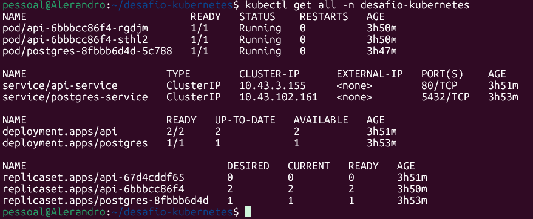
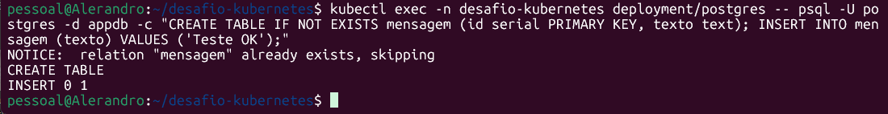
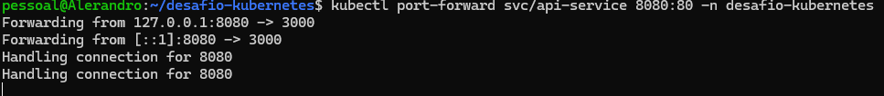
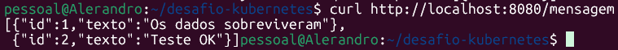
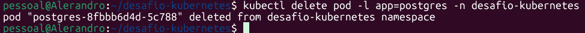
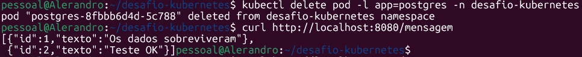

# Desafio: Fundamentos de Kubernetes na Prática

Este projeto implementa uma API (PostgREST) integrada a um banco de dados (PostgreSQL) dentro de um cluster Kubernetes local.

## Ferramenta de Cluster Utilizada
- **Ambiente:** WSL (Ubuntu)
- **Cluster Local:** k3s / Kubernetes integrado

## Como rodar na maquina
```bash
git clone https://github.com/AlerandroFS/Desafio-Kubernetes.git
cd Desafio-Kubernetes
```

## Ordem de Aplicação dos Manifests
Os manifests foram separados e numerados para garantir a ordem correta de dependências. Execute os comandos na seguinte ordem:

```bash
kubectl apply -f 01-namespace.yaml
kubectl apply -f 02-config-secret.yaml
kubectl apply -f 03-postgres.yaml
kubectl apply -f 04-api.yaml
```

## Evidências

1. Vendo tudo que ta rodando no namespace


2. Inserindo dado no postgres


3. Fazendo o port-forward da api 


4. Testando o curl e vendo que a api respondeu


5. Derrubando o pod do banco pra testar a falha


6. Dando o comando curl novamente pra ver se os dados sobreviveram mesmo (persistencia)


## Como Testar
Inserir dados no banco:

```bash
kubectl exec -n desafio-kubernetes deployment/postgres -- psql -U postgres -d appdb -c "CREATE TABLE IF NOT EXISTS mensagem (id serial PRIMARY KEY, texto text); INSERT INTO mensagem (texto) VALUES ('Teste OK');"
```
Aceder à API:

```bash
kubectl port-forward svc/api-service 8080:80 -n desafio-kubernetes
```

Em outro terminal, usar o comando "curl" pra ver se a API tá retornando os dados:

```bash
curl http://localhost:8080/mensagem
```

Apagar o pod do banco para validar o PVC:

```bash
kubectl delete pod -l app=postgres -n desafio-kubernetes
```
Usar o comando "curl" novamente para ver se os dados sobreviveram

```bash
curl http://localhost:8080/mensagem
```
